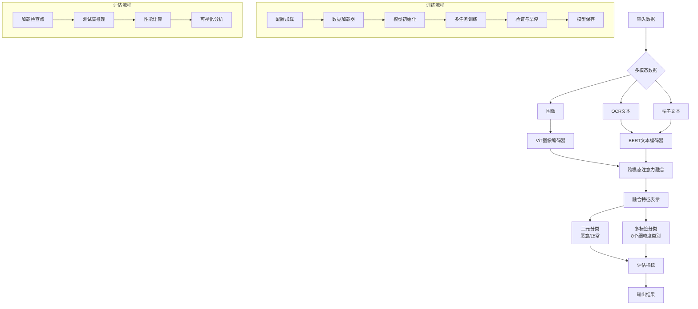

# 多模态恶意言论检测作业

基于M3数据集（Multi-platform, Multi-lingual, Multimodal Meme Dataset）的多模态恶意言论检测模型实现。

## 组员

孙翌洋2243711419
石梓煜2241514452

## 项目概述

本项目实现了一个完整的多模态恶意言论检测系统，包括：

- 数据加载与预处理（支持图像、OCR文本、帖子文本）
- 多模态融合模型（ViT + BERT + 注意力融合）
- 多任务训练（二元分类 + 多标签分类）
- 全面评估指标和可视化

## 系统架构

下图展示多模态恶意言论检测系统的完整工作流程：



**流程说明：**

1. **数据输入**: 接收多模态输入（图像、OCR文本、帖子文本）
2. **特征提取**: 使用ViT提取图像特征，BERT提取文本特征
3. **多模态融合**: 通过跨模态注意力机制融合图像和文本特征
4. **分类任务**: 同时进行二元分类（恶意/正常）和多标签分类（8个细粒度类别）
5. **训练流程**: 完整的训练循环，包括配置加载、数据准备、模型训练、验证和保存
6. **评估流程**: 加载训练好的模型，在测试集上进行推理和性能评估

## 数据集

使用M3数据集（多平台、多语言、多模态模因数据集）：

- 2,455个样本（来自4chan、X、微博）
- 多模态：图像 + OCR文本 + 帖子文本
- 标注：二元标签（恶意/正常） + 8个细粒度恶意类别 + 解释

代码支持虚拟数据模式用于开发和测试。

## 项目结构

```
multimodal_hate_speech/
├── data/              # 数据加载与预处理
│   ├── dataset.py     # M3数据集类
│   ├── preprocessing.py # 图像/文本预处理
│   └── download.py    # 数据下载脚本
├── models/            # 模型定义
│   ├── multimodal_fusion.py # 多模态融合模型
│   └── __init__.py
├── training/          # 训练与评估
│   ├── trainer.py    # 训练循环
│   ├── losses.py     # 损失函数
│   ├── metrics.py    # 评估指标
│   └── __init__.py
├── experiments/       # 实验与分析
├── configs/          # 配置文件
│   └── base_config.yaml # 基础配置
├── utils/            # 工具函数
├── notebooks/        # Jupyter笔记本
├── requirements.txt  # 依赖列表
├── train.py          # 主训练脚本
├── evaluate.py       # 评估脚本
├── test_integration.py # 集成测试
└── README.md
```

## 快速开始

### 1. 环境配置

```bash
# 创建虚拟环境（可选）
python -m venv venv
source venv/bin/activate  # Linux/Mac
# 或 venv\Scripts\activate  # Windows

# 安装依赖
pip install -r requirements.txt
```

### 2. 测试环境

```bash
python test_integration.py
```

### 3. 使用虚拟数据训练

```bash
# 使用虚拟数据进行训练（无需真实数据集）
python train.py --config configs/base_config.yaml
```

### 4. 使用真实数据训练

1. 下载M3数据集到 `data/` 目录
2. 修改 `configs/base_config.yaml` 中的 `use_dummy: false`
3. 运行训练脚本

### 5. 评估模型

```bash
python evaluate.py --checkpoint checkpoints/best_model.pt
```

## 配置说明

主要配置文件 `configs/base_config.yaml`：

- `data`: 数据相关配置（批大小、图像尺寸等）
- `model`: 模型架构配置（编码器选择、融合维度等）
- `training`: 训练参数（学习率、轮数、损失权重等）
- `evaluation`: 评估设置

## 模型架构

核心模型 `MultimodalFusionModel`：

1. **图像编码器**: Vision Transformer (ViT-B/16)
2. **文本编码器**: 多语言BERT
3. **融合层**: 跨模态注意力机制
4. **分类头**: 二元分类 + 多标签分类

## 实验结果

使用虚拟数据的预期性能（仅供参考）：

- 二元分类准确率: ~65-75%
- 多标签分类F1宏平均: ~60-70%

使用真实数据并适当调参可达到论文报告的性能（Qwen3-VL-8B-Instruct为最佳模型）。

## 扩展方向

1. **尝试不同模型**: 微调Qwen-VL、LLaVA等多模态大模型
2. **改进融合策略**: 探索更先进的多模态融合方法
3. **跨语言分析**: 研究模型在不同语言上的表现差异
4. **可解释性**: 使用注意力可视化解释模型决策

## 参考文献

- M3数据集论文: "Is AI Ready for Multimodal Hate Speech Detection? A Comprehensive Dataset and Benchmark Evaluation"
- 项目地址: https://github.com/mira-ai-lab/M3

## 许可证

MIT
